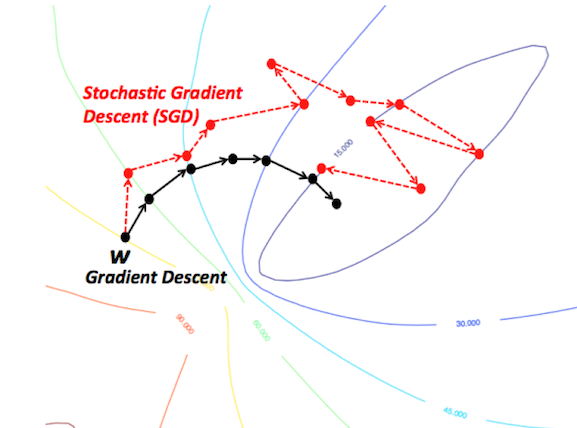

## Theory

### Some notation:
- $\Theta$: The parameter space of a machine learning model.
- $f_{\theta}(\cdot)$ - The model to train. Given a feature vector, it predicts a target variable (see below)
- $\mathcal{D}$: A dataset for supervised learning, formally a set of $n$ pairs, $(X_i,y_i)$, where $X_i$ denotes a feature vector (input variable), and $y_i$ is the corresponding target variable.
- $\widehat{y}_i$ - The model prediction given a feature vector, $X_i$.
- $L(y_i,\widehat{y_i})$ - The loss function (essentially a distance function between actual target variable and that predicted by model.
- $C$ - The cost function, which measures a model's error over a group of training instances ($C = \sum_{i} L(y_i,\widehat{y}_i)$).
- $\nabla_{\theta_{t}}C$ - The derivative of the cost function w.r.t the model parameters at time step $t$. Vector-valued.

**What is an optimiser?** - Our ultimate aim in training a neural network is to find the optimal parameterised function $f_{\theta}$, for a given task. This is reduces to searching over the parameter space for $\theta$ for an optimal set of parameters, $\theta_{opt}$. Given that the parameter space can be millions or billions of dimensions in current neural networks, this search must be performed intelligently. This is the job of our optimisation algorithm. 

### Vanilla gradient descent (VGD)

There are essentially three variants of gradient descent. They are characterised by the number of samples in the training dataset that are used to compute the cost function (which is in turn needed for the gradient vector, and paramater updates). They are as follows:

1. **Batch gradient descent**: Uses *all* the training instances in the training dataset to compute the cost function. Whilst this gives the best possible reflection of model performance, it is expensive to implement for large training datasets. 
2. **Stochastic gradient descent**: The converse of batch gradient descent, stochastic gradient descent uses just *one* training instance to calculate the cost, with this training instance chosen randomly. Whilst cheap to implement, this method leads to very noisy parameter updates (movement over parameter space follows no clear direction over short timescales), due to the inaccuracy rising from modelling model performance across the whole training dataset with its loss on just one training instance.
3. **Mini-batch gradient descent**: An attempt at achieving the best of both worlds with regards to batch/stochastic gradient descent. One chooses a batch size, $m$, and the cost is computed as the average over $m$ randomly chosen training instances.

    <figure>
        
        <figcaption>Src: https://towardsdatascience.com/improving-vanilla-gradient-descent-f9d91031ab1d</figcaption>
    </figure>

However, the following challenges are present in all versions of vanilla gradient descent:
1. **Difficulty in choosing learning rate** - A large learning rate may lead to no convergence, with the optimiser instead just oscillating around some (global/local) minimum. Too small a learning rate runs the risk of getting stuck in local minima, as well as extremely slow convergence (and therefore large training times). 
2. **Non-adaptive learning rate schedules** - One quick fix to problem (1) is to have the learning rate vary as a function of time, or epoch number. This is known as setting a learning rate schedule. Whilst this sometimes works, the learning rate must be set in advance of the training process, meaning they cannot adapt to the datasets characteristics (for example, it would be desirable to have a learning rate that adapts to the magnitude of the gradient).
3.) **Global learning rates** - In the methods given above, one learning rate is applied to all parameters. We would like a learning rate that accounts for this.
4.) **Getting stuck in local minima** - For highly non-convex functions, it is likely that variants of gradient descent will get stuck in suboptimal local minima. We would like to develop techniques that encourage convergence toward global minima in parameter space.

### Momentum:

As hinted above, some directions in parameter space may be considerably steeper than others. This can lead to oscillation without real progress towards local/global minimum when using VGD. The momentum adaptation to gradient descent gives the parameter update some inertia in the direction that it is moving, similar to that which a heavy ball has when rolling down a slope. This is shown in the figure below:

    <figure>
        
        <figcaption></figcaption>
    </figure>

Formally, we can define the weight update for gradient descent with a momentum adaptation as follows:

\begin{align*}
\theta_{t+1} = \theta_{t} + \Delta \theta_{t} \\
\Delta\theta_t = -\eta \nabla_{\theta_t}C + \alpha \Delta \theta_{t-1}
\end{align*}

In short, there is an additional term that incorporates the direction of the parameter update from the previous step, giving the current parameter update 'momentum' in this direction. $\alpha$ is a user defined hyperparameter.

### Adaptive Momentum (Adagrad):

Adagrad adapts the learning rate to the scale of the gradient along directions in parameter space *and* the elapsed training time. As a result, rather than a scalar learning rate, we now have a vector learning rate $\mathbf{\eta}$. The Adagrad weight update for the $i$th parameter, at time $t$ takes the form:

\begin{align*}
\theta_{t+1,i} = \theta_{t,i} - \eta_{t,i} g_{t,i} \\
g_{t,i} = (\nabla_{\theta_{t}}C)_i
\end{align*}

$g_{t,i}$ is just the $i$th component of the gradient vector.  
We need to define two further terms. First, we introduce the diagonal matrix $G_t \in \mathbb{R}^{d \times d}$, where $d$ is the dimension of parameter space. The $i$th nonzero element of $G_t$, $G_{t,ii}$ is the sum of the squares of the gradients in the direction of $\theta_{i}$ up to time step $t$: $G_{t,ii} = \sum_{j}^{t-1}g_{j,i}^{2}$. We can then use this term to scale the learning rate accordingly, yielding:

$$
\eta_{t,i} = \frac{\eta}{\sqrt{G_{t,ii} + \epsilon}}
$$

where $\epsilon$ is some small positive number to prevent division by zero errors and $\eta$ is a hyperparameter.

### Sui